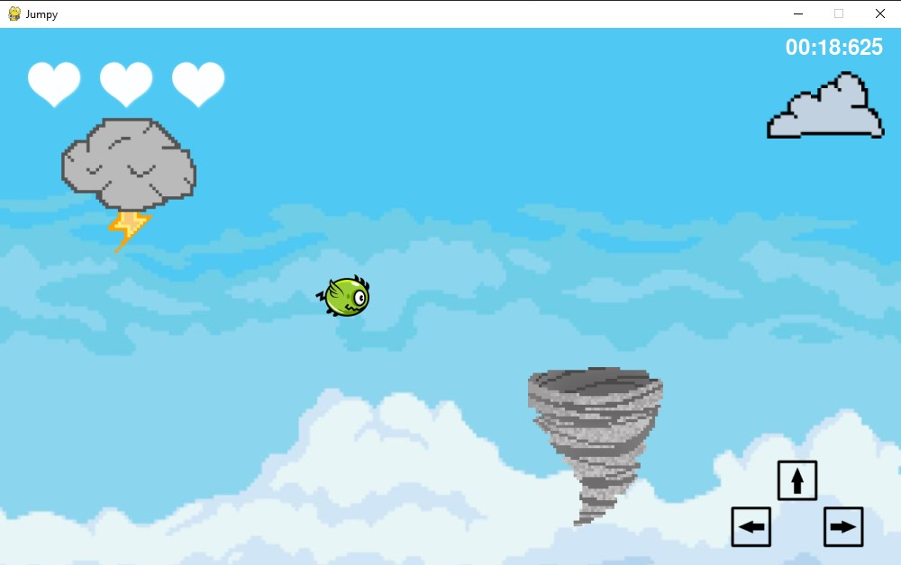

 # Welcome to Jumpy!
 
 ## In this game, you will be avoiding 3 objects with a small bird (Jumpy), as they will try to hit you. 1 of them has a special ability - find out what it is! Good luck!

 ### Functionalities:
 - Jumpy is constantly falling down, flying up with each UP arrow key on keyboard,
 - Game has borders, blocking north, east and west ways, to prevent from loosing Jumpy out of board,
 - Player has 3 lives (white hearts in top-left corner):
   - hitting an object will lose 1 life and resets Jumpys positions, as well as objects positions,
   - falling bellow south border (player fails to keep him on screen) also loses 1 life
   - if player lose all 3 lives - game ends
 - Timer in top-right corner of game - try to survive as long as possible!
 - Bottom-right corner indicates how can a player control Jumpy

 ## Game

