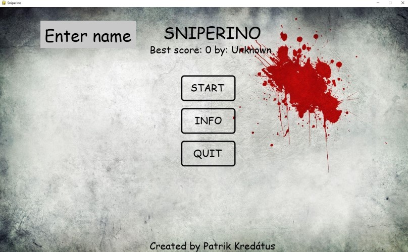
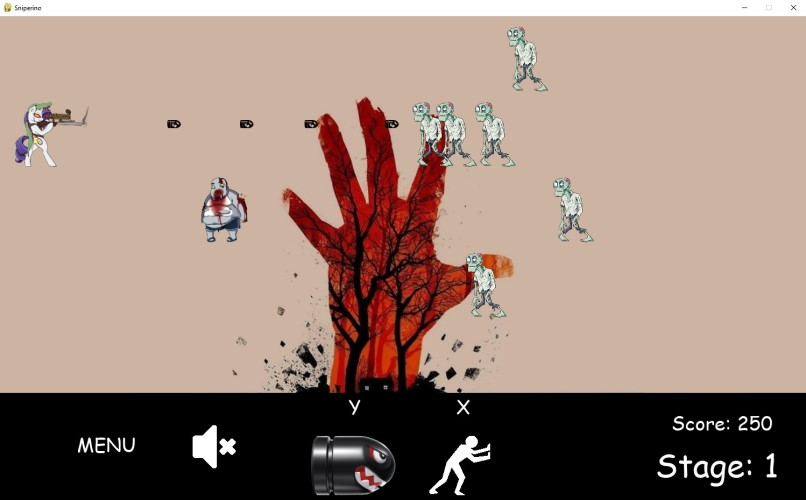
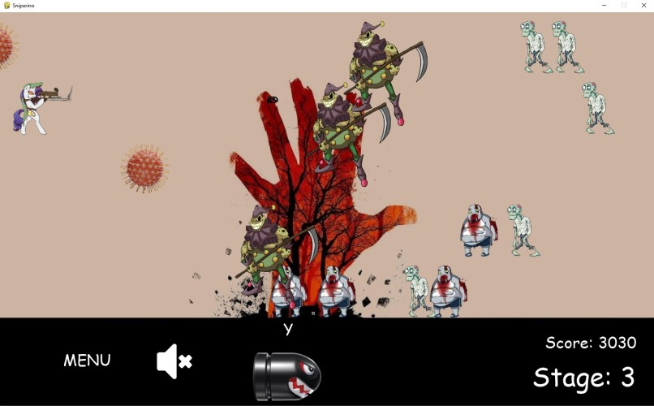

 # Welcome to Sniperino!
 
## Let me introduce you into gameplay:
 - Zombies are coming from the right side to the left(trying to kill sniper)
 - Your mission is to survive as long as possible, completing various game stages with different kinds of zombies
 - Avoid any collision with zombies and viruses
 - Do not let zombies pass the sniper
 - Increasing game score also increases Stage, if you manage to kill Zombie_Boss, infinite stage4 will begin

## Controls:
 - UP or DOWN arrows - move sniper
 - SPACE - shoot
 - ESC - menu / quit
 - while inserting name:
   - ENTER to confirm the name
   - BACKSPACE to delete 1 character
 - Y and X keys to use skills
 

 ### Menu
 - Enter your name
 - Best local score + players name
 - Start game
 - Info (showing HP and damage of zombies/bullets, game controls etc.)
 - Quit the game

 ### Stage1

 - Game bar:
   - Menu button
   - Sound on/off
   - Skills, triggered by X or Y keys
   - Score and current stage

 ### Stage3
