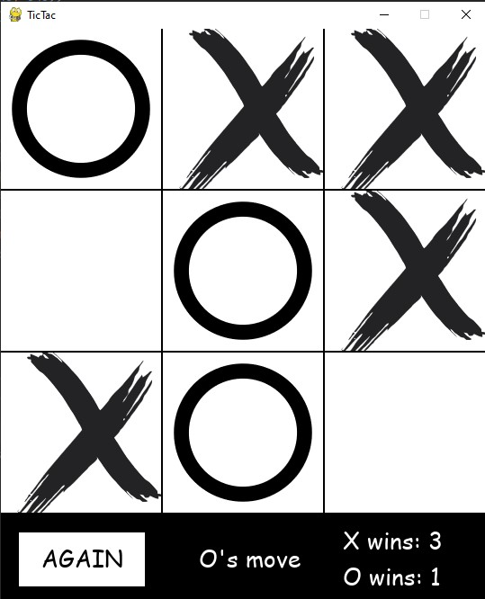

 # Welcome to my TicTacToe game!
 
 ## Game that everybody knows, no need of further introduction.

 ### Functionalities:
 - Board consisting of 9 squares, 3x3
 - Player is trying to get a match of 3 squares, vertically/horizontally and diagonally
 - Bottom side of game:
   - AGAIN button to clear the game and start again
   - Text indicator of whose turn it is now
   - Counter of X's wins and O's wins
 - If all 9 squares are filled out and nobody wins, you can press AGAIN button to start over again
 - If winner is decided, whole screen turns to black, saying who has won and after 1 second, game resets
 - In download_link.txt you can find the game in .exe file, just extract files from downloaded .zip

 ## Ongoing game
