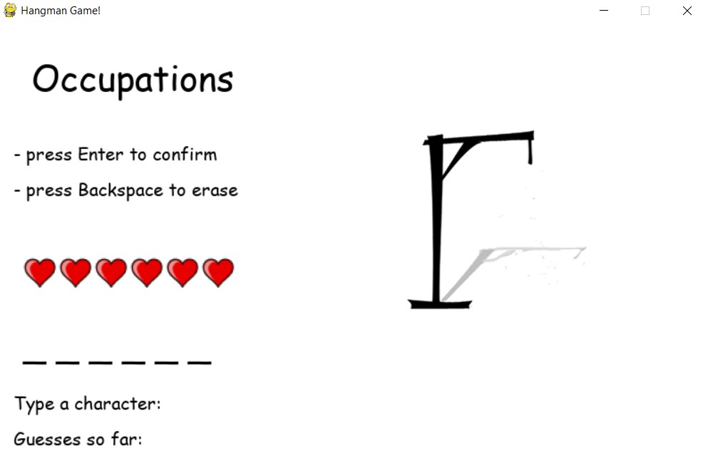
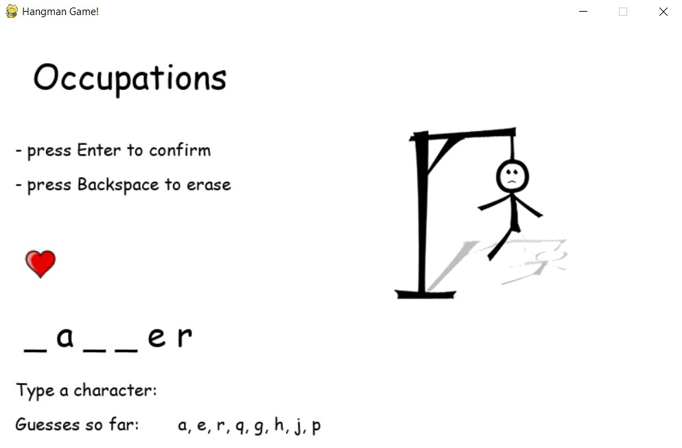
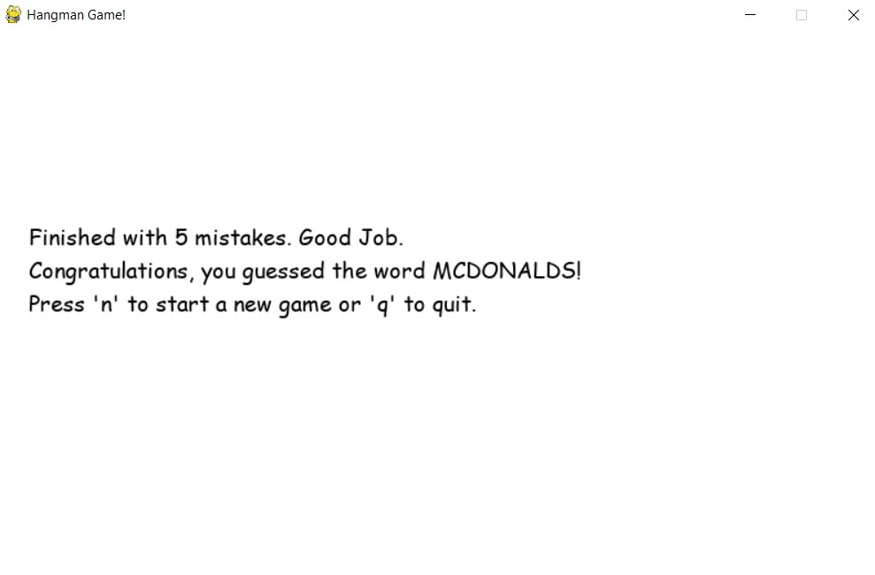
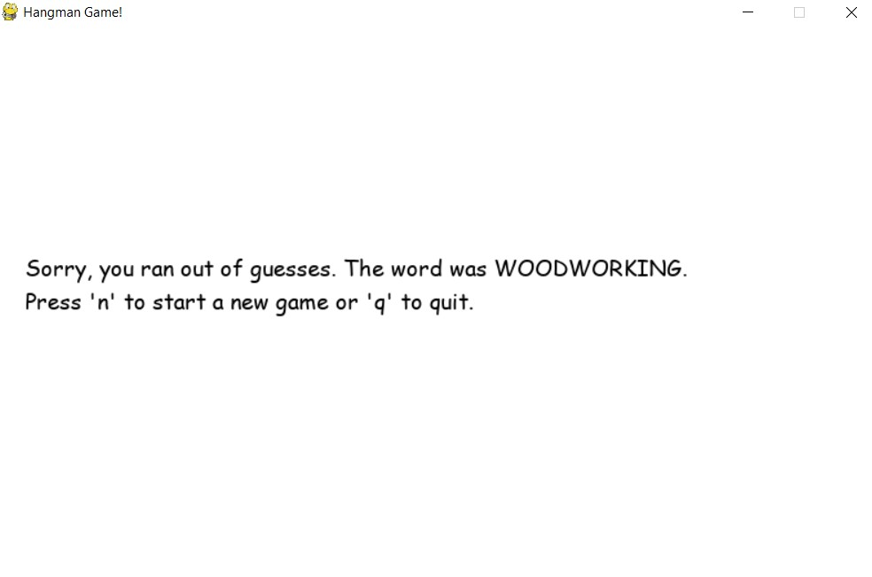

 # Welcome to Hangman pygame!
 ### In this game, you will be guessing a hidden word, randomly chosen from 9 categories. Press any alphabetic character and confirm it with Enter. In case of success, your character will appear instead of underscore, otherwise you loose 1 life (out of total 6) and the image of hangman proceeds to next stage. Your goal is to guess a whole random word, before you run out of lives! Enjoy
 ## Functionalities:
 - Randomly chosen category and a word out of that category
 - Creating a set of underscores, long exactly as random word
 - Game remembers which characters User already guessed and prints them out on game window
 - Guesses are based on typing to keyboard
   - Enter key to confirm users guess
   - Backspace key to erase current input (both are printed to game window as guide)
 - Upon starting new game, there are 6 red hearts in game, showing remaining lives
 - With each new mistake(wrong guess) there is a .png image of Hangman, changing with number of wrong guesses
 - User can input only alphabetic characters, doesn't matter if it's lower or upper case, game words are all using only lower case characters and remembered guesses are all saved as lower
 - User cannot use the same character more than once, if random word contains more than 1 of guessed character, underscores will change accordingly
 - 4 implemented sounds, upon right/wrong guess and successful/lost finish
 - Game ends either with correctly guessed whole word, or if user makes a wrong guess 6 times
 - After finish, user gets some information about wrong guesses and an option:
   - press 'n' character to start a new game
   - press 'q' character to quit (both working on direct press, don't need to be confirmed)
 - If User decides to play again, new random word is chosen and all stats like right guess, wrong guess, guesses so far etc. will reset to starting values

 ## New game

 ## 5 wrong guesses

 ## Success / Defeat

